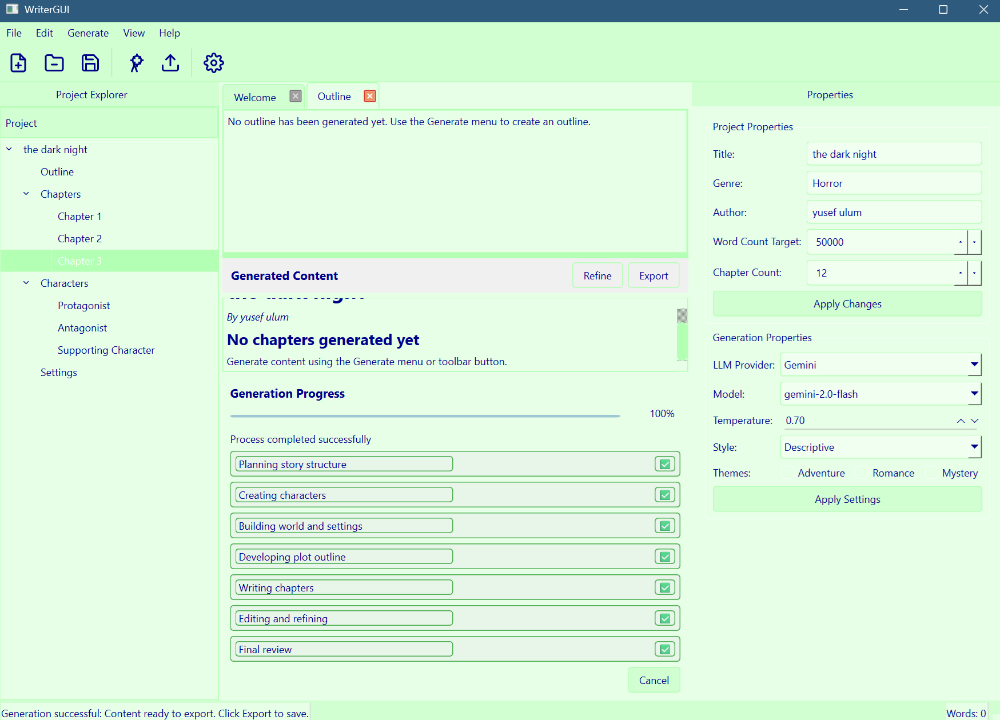

# fmus-write

An AI-powered content creation app.
(Work in progress)



## Features

- Intuitive, modern PyQt6 interface
- Full integration with FMUS-Write capabilities
- Project management
- Content generation
- Character and setting management
- Multiple export formats
- Consistency checking
- Dark and light themes

## Installation

### Prerequisites

- Python 3.8 or higher

### Install from source

```bash
# Clone the repository
git clone https://github.com/mexyusef/fmus-write.git
cd writergui

# Install dependencies
pip install -r requirements.txt

# Install the package
pip install -e .
```

## Usage

### Running from the command line

#### fmus_write

```bash
python -m fmus_write.main
```

```bash
# Generate a new book
fmus-write generate --title "My Amazing Book" --genre "Science Fiction" --output book.md

# Configure settings
fmus-write config --key api_key --value "your-api-key-here"

# Export to different formats
fmus-write export --input book.json --output book.epub --format epub
```

#### writergui

```bash
python -m writegui.main

# Or use the entry point if installed
writegui
```

### Running with batch file

On Windows, you can use the provided batch file:

```bash
# From the project directory
.\run.bat
```

### Python API
```python
from fmus_write import BookProject

# Create a new project
project = BookProject(
    title="My Amazing Book",
    genre="Science Fiction",
    settings={
        "api_key": "your-api-key-here",
        "temperature": 0.7
    }
)

# Generate content
project.generate(workflow_type="complete_book")

# Export to file
project.export("my_book.md", format="markdown")
```

## Development

### Project Structure

It has a library part - with CLI (fmus_write) and an app part (writegui).
```
fmus-write/
    fmus_write/
    writegui/
    setup.py             # Installation script
    requirements.txt     # Dependencies
```

## License

This project is licensed under the MIT License - see the LICENSE file for details.
